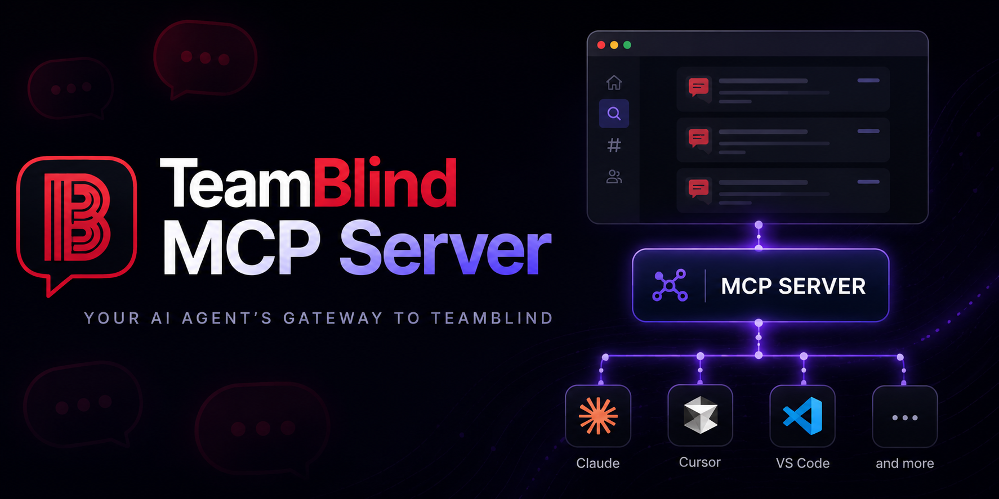

<div align="center">



**Let your AI agent research Blind discussions on your behalf.**

[](https://www.npmjs.com/package/@usrivastava92/teamblind-mcp)
[](https://github.com/usrivastava92/teamblind-mcp/actions/workflows/ci.yml)
[](LICENSE)
[](https://github.com/usrivastava92/teamblind-mcp/commits/main)
[](https://scorecard.dev/status/github.com/usrivastava92/teamblind-mcp)

Give Claude, VS Code Copilot, and any MCP-compatible assistant access to your TeamBlind — search posts, browse your feed, read company gossip, and stay on top of workplace conversations without switching tabs.

</div>

---

## Installation Methods

[](https://github.com/npm/cli#readme)

### npx Setup (Recommended)

**Prerequisites:** [Node.js](https://nodejs.org) >= 22.14.0

#### One-time login

```bash
npx @usrivastava92/teamblind-mcp --login
```

This opens a Chromium browser window. Log into TeamBlind normally (Google, Apple, or email). The server detects your login, saves the session, and exits. You have **5 minutes** to complete login and any 2FA challenges by default.

If you are already logged in, the command detects the active session, refreshes the saved state, and exits without forcing the login screen.

To intentionally reset the saved session and log in again:

```bash
npx @usrivastava92/teamblind-mcp --login --force
```

#### Client Configuration

**Claude Desktop / Generic MCP Client** (`claude_desktop_config.json`):

```json
{
  "mcpServers": {
    "teamblind": {
      "command": "npx",
      "args": ["-y", "@usrivastava92/teamblind-mcp@latest"]
    }
  }
}
```

**VS Code** (`.vscode/mcp.json`):

```json
{
  "servers": {
    "teamblind": {
      "type": "stdio",
      "command": "npx",
      "args": ["-y", "@usrivastava92/teamblind-mcp@latest"]
    }
  }
}
```

The `@latest` tag ensures you always run the newest version — `npx` checks npm on each client launch and updates automatically. The server starts quickly and reuses your saved browser session from `~/.config/teamblind-mcp/`.

> **Note:** Early tool calls may return an authentication error if your session has expired. Re-run `npx @usrivastava92/teamblind-mcp --login` to refresh, or add `--force` to wipe the saved session first.

---

### Local Setup (Develop & Contribute)

Contributions are welcome! Please open an issue first to discuss features or bug fixes before submitting a PR.

**Prerequisites:** [Git](https://git-scm.com/downloads), [Node.js](https://nodejs.org) >= 22.14.0, [Yarn](https://yarnpkg.com) 4.x

```bash
# 1. Clone the repo
git clone https://github.com/usrivastava92/teamblind-mcp
cd teamblind-mcp

# 2. Install dependencies
yarn install

# 3. Build
yarn build

# 4. Login (one-time)
yarn login

# 5. Start the MCP server
yarn start
```

**Client Configuration** (pointing to your local checkout):

```json
{
  "mcpServers": {
    "teamblind": {
      "command": "node",
      "args": ["dist/index.js"],
      "cwd": "/path/to/teamblind-mcp"
    }
  }
}
```

---

## Available Tools

| Tool                  | Description                                                                                                                                     |
| --------------------- | ----------------------------------------------------------------------------------------------------------------------------------------------- |
| `search`              | Search TeamBlind for posts matching a query. Returns extracted post summaries (title, author, company, content, stats).                         |
| `fetch_post`          | Fetch a TeamBlind post by slug. Returns post details and comments.                                                                              |
| `get_feed`            | Get recent posts from your authenticated TeamBlind home feed. Accepts `scrollCount` to load more items.                                         |
| `list_my_companies`   | List all company private channels you have access to on TeamBlind. Returns company names and aliases.                                           |
| `get_company_channel` | Get posts from a company's private channel (e.g. `Google`). Requires employee-level access. Accepts `company` alias and optional `scrollCount`. |
| `close_session`       | Close the browser session and clean up resources. Saves cookies before closing.                                                                 |

---

## CLI Reference

```
teamblind-mcp --login          Open browser for interactive login
teamblind-mcp --login --force  Clear saved session, then re-login
teamblind-mcp --logout         Clear stored authentication state
teamblind-mcp [flags]          Start the MCP server (stdio)
```

| Flag              | Default                   | Description                                    |
| ----------------- | ------------------------- | ---------------------------------------------- |
| `--no-headless`   | `false`                   | Show the browser window (useful for debugging) |
| `--log-level`     | `ERROR`                   | One of `DEBUG`, `INFO`, `WARN`, `ERROR`        |
| `--login-timeout` | `300`                     | Login timeout in seconds                       |
| `--user-data-dir` | `~/.config/teamblind-mcp` | Path to persistent browser profile             |
| `--timeout`       | `15000`                   | Browser page operation timeout in milliseconds |
| `--tool-timeout`  | `180`                     | Per-tool execution timeout in seconds          |

Environment variable equivalents exist for most flags:

| Variable                  | Description                                     |
| ------------------------- | ----------------------------------------------- |
| `TEAMBLIND_BASE_URL`      | Base URL (default: `https://www.teamblind.com`) |
| `TEAMBLIND_USER_DATA_DIR` | Override session storage path                   |
| `HEADLESS`                | Set to `0` or `false` for non-headless          |
| `LOGIN_TIMEOUT`           | Login timeout in seconds                        |
| `LOG_LEVEL`               | Logging level                                   |
| `TIMEOUT`                 | Browser page operation timeout in ms            |
| `TOOL_TIMEOUT`            | Per-tool timeout in seconds                     |

---

## Session Storage

All session data is stored under `~/.config/teamblind-mcp/`:

```
~/.config/teamblind-mcp/
├── profile/               # Chromium persistent profile
├── cookies.json           # Portable cookie export
└── source-state.json      # Session metadata
```

- **Profile**: Your browser profile persists between restarts — cookies, localStorage, and IndexedDB are all preserved
- **Cookies**: Exported as JSON for portability and validation
- **Permissions**: All session files are created with owner-only permissions (`0700` for dirs, `0600` for files)

---

## Troubleshooting

| Symptom                                      | Fix                                                                                                                                                              |
| -------------------------------------------- | ---------------------------------------------------------------------------------------------------------------------------------------------------------------- |
| **"No authentication state found"**          | You haven't logged in yet. Run `npx @usrivastava92/teamblind-mcp --login`.                                                                                       |
| **"Not logged into TeamBlind"**              | Your session may have expired. Run `npx @usrivastava92/teamblind-mcp --login` to reuse it if still valid, or `--login --force` for a fresh session.              |
| **Browser window doesn't open on `--login`** | Chromium is downloaded automatically on `npm install`. If missing, run: `npx playwright install chromium`.                                                       |
| **Tool calls time out**                      | Increase the timeout: `--timeout 30000` or set `TIMEOUT=30000`.                                                                                                  |
| **Want to debug browser actions?**           | Use `--no-headless` to see the browser window while tools execute.                                                                                               |
| **Clear everything and start fresh**         | Run `npx @usrivastava92/teamblind-mcp --logout` then `npx @usrivastava92/teamblind-mcp --login`, or just use `npx @usrivastava92/teamblind-mcp --login --force`. |
| **Login hangs or captcha appears**           | Run `--login` with `--no-headless` so you can solve the captcha manually in the browser window.                                                                  |

---

> [!IMPORTANT]
> FAQ
>
> Is this safe to use? Will I get banned?
>
> This tool controls a real authenticated browser session; it doesn't exploit undocumented APIs or bypass authentication. That said, TeamBlind's Terms of Service may prohibit automated tools and browser automation. So far, no user bans related to this project have been reported. However, platform policies can change at any time, so use responsibly and at your own discretion. If you encounter any issues, please open a discussion or issue on GitHub.
>
> What if my agents execute too many actions?
>
> TeamBlind may apply rate limits, additional verification checks, or other restrictions if it detects excessive automated activity. This MCP executes tool calls sequentially through a shared browser session but does not enforce platform-specific rate limits. Prompt your agents responsibly and avoid unnecessary or excessive requests.

---

## Acknowledgements

Built with [Model Context Protocol SDK](https://github.com/modelcontextprotocol/typescript-sdk) and [Playwright](https://playwright.dev).

Use in accordance with [TeamBlind's Terms of Service](https://us.teamblind.com/setting/term). This project automates access to TeamBlind through a user-authenticated browser session. Users are responsible for ensuring their usage complies with TeamBlind's Terms of Service and applicable policies.

## License

[MIT](LICENSE)
